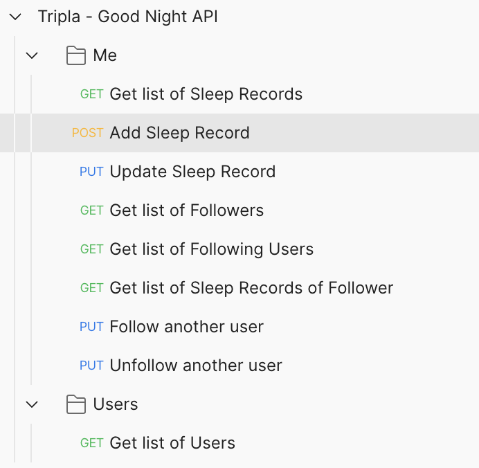

# Tripla - Good night APIs

A “good night” application to let users track when do they go to bed and when do they wake up.

We require some restful APIS to achieve the following:

1. Clock In operation, and return all clocked-in times, ordered by created time.
2. Users can follow and unfollow other users.
3. See the sleep records over the past week for their friends, ordered by the length of their sleep.

------------------------------------------------------------------------

## Table of Contents

* [How to run](#how-to-run)
* [DB design & Entity Relationship Diagram](#db-design--entity-relationship-diagram-erd)
* [API documentation (Postman Collection)](#api-documentation-postman-collection)

------------------------------------------------------------------------

## How to run

1. Clone the repo
2. Install gems (current using Ruby 3.1.0)
    ```
   bundle install
    ```
3. Set up DB and seed data
    ```
   rake db:create && rake db:migrate && rake db:seed
    ```
4. Run tests suite (optional)
    ```
   rails test
    ```
5. Start web server
    ```
   rails s
    ```
6. Open Postman and import the Collection provided at `doc/Tripla - Good Night API.postman_collection.json`.
Please view the section [API documentation (Postman Collection)](#api-documentation-postman-collection) for more details

------------------------------------------------------------------------

## DB Design & Entity Relationship Diagram (ERD)


------------------------------------------------------------------------

## API documentation (Postman collection)

**Noted / required**
As we are not implementing any authentication logic, so the current user is set by the `current-user-id` header key/value, please make to sure include this in request headers

The provided Postman collection included following APIs, group by folders


- **Users**: included only APIs related to User model
- **Me**: included APIs actions for the current logged in user such as: add / update Sleep records, follow / unfollow another user ...

As for API requests / params, they are quite self-explanatory, please refer while making requests
